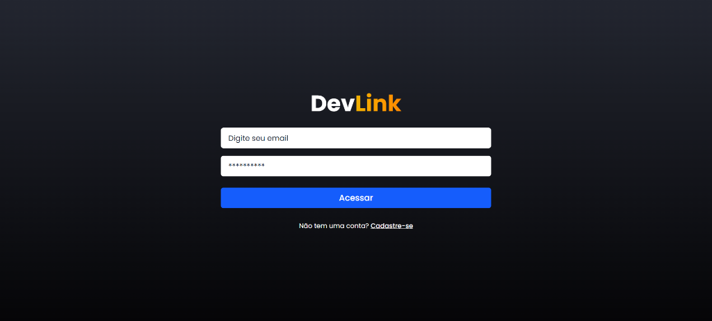
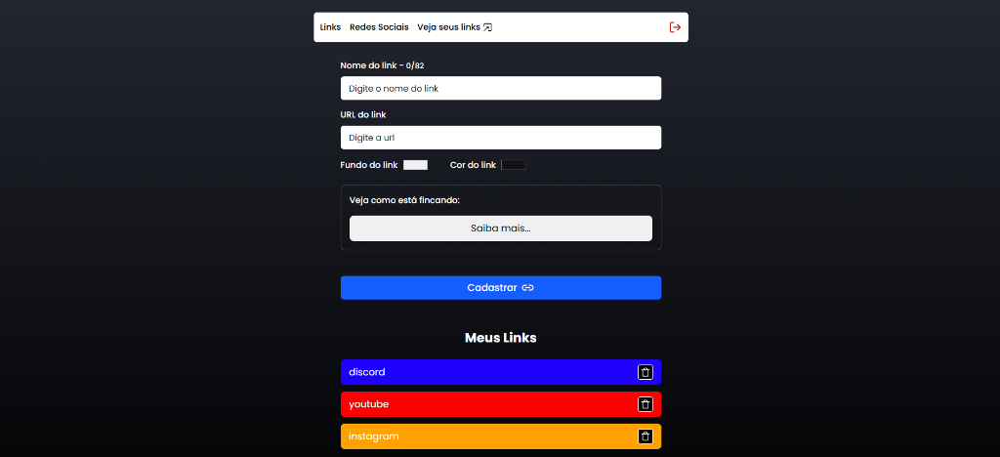
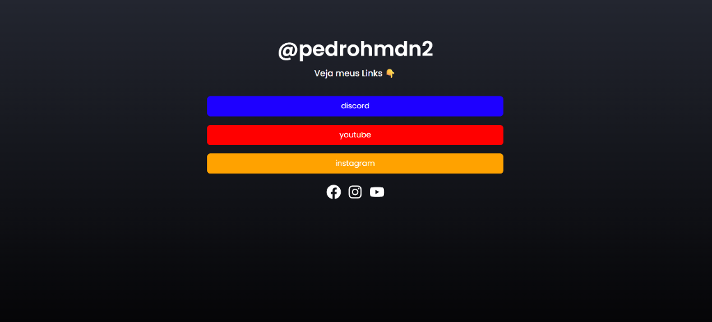

<div align="center">

# 🔗 DevLink

### Sua página de links personalizada · Your custom link page

[](https://react.dev/)
[](https://www.typescriptlang.org/)
[](https://firebase.google.com/)
[](https://tailwindcss.com/)
[](https://vitejs.dev/)

🌐 **[Acesse o projeto · Live Demo](https://devlink-tree.vercel.app)**

</div>

---

<details open>
<summary><h2>🇧🇷 Português</h2></summary>

### 📖 Sobre

**DevLink** é um agregador de links inspirado no Linktree, construído com React e Firebase. Permite que desenvolvedores e criadores de conteúdo criem uma página personalizada reunindo todos os seus links importantes em um só lugar com cores customizáveis e ícones de redes sociais.

### 📸 Screenshots

<div align="center">

| Tela de Login | Painel Administrativo | Página de Links |
|:---:|:---:|:---:|
|  |  |  |

</div>

### ✨ Funcionalidades

- 🔐 **Autenticação** — Login e cadastro de usuários com Firebase Auth
- 🔗 **Gerenciamento de links** — Adicione, edite e remova links com facilidade
- 🎨 **Personalização** — Escolha as cores de fundo e texto de cada link
- 📱 **Redes sociais** — Cadastre seus perfis do Facebook, Instagram e YouTube
- 👀 **Pré-visualização** — Veja como seu link ficará antes de publicar
- 🌐 **Página pública** — Cada usuário tem sua própria URL pública (`/links/seu-usuario`)
- 🛡️ **Rotas protegidas** — Painel admin acessível somente após autenticação
- 📱 **Responsivo** — Interface adaptável para diferentes tamanhos de tela

### 🛠️ Tecnologias

| Tecnologia | Uso |
|---|---|
| **React 19** | Biblioteca para construção da interface |
| **TypeScript** | Tipagem estática para maior segurança no código |
| **Vite 8** | Build tool e dev server ultrarrápido |
| **Tailwind CSS 4** | Framework CSS utilitário para estilização |
| **Firebase** | Autenticação (Auth) e banco de dados (Firestore) |
| **React Router** | Navegação e roteamento entre páginas |
| **React Toastify** | Notificações toast elegantes |
| **React Icons** | Biblioteca de ícones para redes sociais |

### 🚀 Como executar

**Pré-requisitos:** Node.js 18+ e npm

```bash
# Clone o repositório
git clone https://github.com/Pedrohmdn/devlink-tree.git

# Acesse a pasta do projeto
cd projeto-devlink

# Instale as dependências
npm install

# Configure as variáveis de ambiente
# Crie um arquivo .env.local com suas credenciais do Firebase:
# VITE_API_KEY=sua-api-key
# VITE_AUTH_DOMAIN=seu-auth-domain
# VITE_PROJECT_ID=seu-project-id
# VITE_STORAGE_BUCKET=seu-storage-bucket
# VITE_MESSAGING_SENDER_ID=seu-sender-id
# VITE_APP_ID=seu-app-id

# Inicie o servidor de desenvolvimento
npm run dev
```

### 📁 Estrutura do projeto

```
src/
├── components/        # Componentes reutilizáveis (Header, Input, Social, etc.)
├── contexts/          # Contexto de autenticação do usuário
├── pages/             # Páginas da aplicação
│   ├── Admin/         # Painel de administração de links
│   ├── Home/          # Página pública de links do usuário
│   ├── Login/         # Tela de login
│   ├── NetWorks/      # Gerenciamento de redes sociais
│   ├── SignUp/        # Tela de cadastro
│   └── Error/         # Página 404
├── routes/            # Rotas protegidas e validação
├── services/          # Configuração do Firebase
└── styles/            # Estilos globais
```

</details>

---

<details>
<summary><h2>🇺🇸 English</h2></summary>

### 📖 About

**DevLink** is a Linktree-inspired link aggregator built with React and Firebase. It allows developers and content creators to build a custom page gathering all their important links in one place with customizable colors and social media icons.

### 📸 Screenshots

<div align="center">

| Login Screen | Admin Panel | Links Page |
|:---:|:---:|:---:|
|  |  |  |

</div>

### ✨ Features

- 🔐 **Authentication** — User login and registration with Firebase Auth
- 🔗 **Link management** — Add, edit, and remove links with ease
- 🎨 **Customization** — Choose the background and text colors for each link
- 📱 **Social networks** — Register your Facebook, Instagram, and YouTube profiles
- 👀 **Live preview** — See how your link will look before publishing
- 🌐 **Public page** — Each user gets their own public URL (`/links/your-username`)
- 🛡️ **Protected routes** — Admin panel accessible only after authentication
- 📱 **Responsive** — Adaptive interface for different screen sizes

### 🛠️ Tech Stack

| Technology | Usage |
|---|---|
| **React 19** | UI library for building the interface |
| **TypeScript** | Static typing for safer code |
| **Vite 8** | Ultra-fast build tool and dev server |
| **Tailwind CSS 4** | Utility-first CSS framework |
| **Firebase** | Authentication (Auth) and database (Firestore) |
| **React Router** | Page navigation and routing |
| **React Toastify** | Elegant toast notifications |
| **React Icons** | Icon library for social media |

### 🚀 Getting Started

**Prerequisites:** Node.js 18+ and npm

```bash
# Clone the repository
git clone https://github.com/your-username/projeto-devlink.git

# Navigate to the project folder
cd projeto-devlink

# Install dependencies
npm install

# Set up environment variables
# Create a .env.local file with your Firebase credentials:
# VITE_API_KEY=your-api-key
# VITE_AUTH_DOMAIN=your-auth-domain
# VITE_PROJECT_ID=your-project-id
# VITE_STORAGE_BUCKET=your-storage-bucket
# VITE_MESSAGING_SENDER_ID=your-sender-id
# VITE_APP_ID=your-app-id

# Start the development server
npm run dev
```

### 📁 Project Structure

```
src/
├── components/        # Reusable components (Header, Input, Social, etc.)
├── contexts/          # User authentication context
├── pages/             # Application pages
│   ├── Admin/         # Link administration panel
│   ├── Home/          # User's public links page
│   ├── Login/         # Login screen
│   ├── NetWorks/      # Social media management
│   ├── SignUp/        # Sign up screen
│   └── Error/         # 404 page
├── routes/            # Protected routes and validation
├── services/          # Firebase configuration
└── styles/            # Global styles
```

</details>

---

<div align="center">

### 📝 Licença · License

Este projeto está sob a licença MIT. · This project is under the MIT license.

</div>
